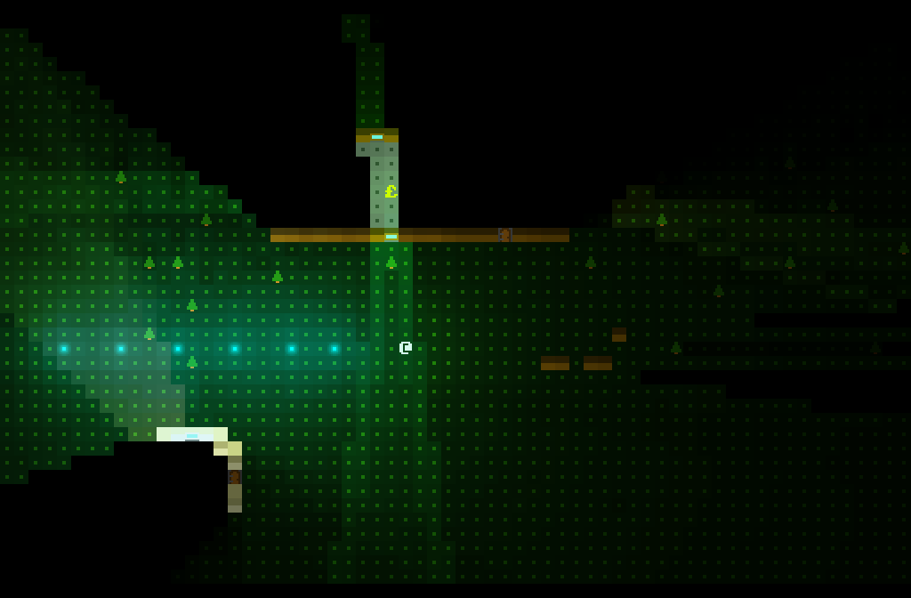

# Roguelike Lighting Demo

[Play in browser!](https://games.gridbugs.org/roguelike-lighting-demo/)

Depends on nodejs 4, as it is built with gulp 3. To install deps, compile, and run local server:
```bash
nvm install v4
npm install
npx gulp
```

Now navigate to 0.0.0.0:8000 in your browser to play!


